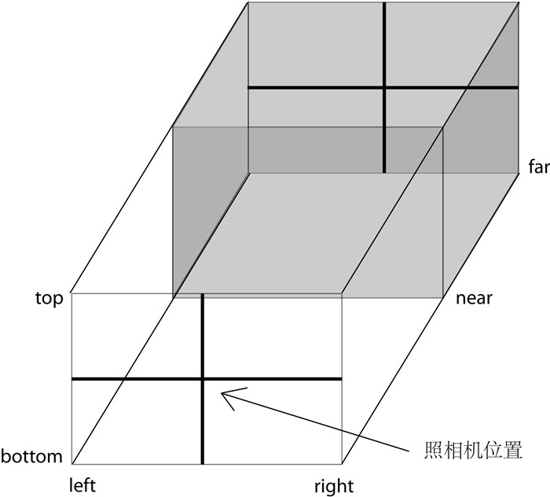

# Three.js
[《Three.js入门指南》](https://www.ituring.com.cn/book/1272)
[Three.js Docs](https://threejs.org/docs/index.html#manual/zh/introduction/Creating-a-scene)
## 第一章 基础
Canvas元素
引入[three.js](https://github.com/mrdoob/three.js)库
一个典型的Three.js程序至少包括以下几个：
1.渲染器 Renderer
2.场景 Scene
3.照相机 Camera
4.在场景中创建的物体

- 渲染器 Renderer
渲染器需要与画布进行绑定
```javascript
var renderer = new THREE.WebGLRenderer({
    canvas: document.getElementById("CanvasId")
});
```
不存在Canvas元素，Three.js可以生成Canvas元素
```javascript
var renderer = new THREE.WebGLRenderer();
renderer.setSize(400, 300);
document.getElementByTagName('body')[0].appendChild(renderer.domElement);
```
将画布背景色设置为黑色
`renderer.setClearColor(0x000000)`

- 场景 Scene
相当于一个容器，用来装载Three.js创建的物体
```javascript
var scene = new THREE.Scene();
```

- 照相机 Camera
坐标系：WebGL和Three.js都是使用的右手坐标系

Three.js共包含两种照相机：
透视投影照相机 Perspective Camera
正交投影照相机 Orthographic Camera
```javascript
var camera = new THREE.PerspectiveCamera(45, 4 / 3, 1, 1000);
camera.position.set(0, 0, 5);
scene.add(camera);
```
更多将在第二章进行描述

- 场景的物体
长方体
```javascript
var cube = new THREE.Mesh(new THREE.CubeGeometry(1, 2, 3), new THREE.MeshBasicMeterial({ color: 0xff0000 }))
scene.add(cube);
```
创建一个长度分别为1、2、3的红色长方体

- 渲染
```javascript
renderer.render(scene, camera);
```

[示例1](./Demo/demo1.html)

## 第二章 照相机
照相机将三维空间投影到二维平面中
透视投影照相机(a)：与人眼一样，拥有视角，近大远小的效果
正交投影照相机(b)：物体的效果不变，三维空间物体的关系在二维空间也一样


- 正交投影照相机 Orthographic
构造函数`THREE.OrthographicCamera(left, right, top, bottom, nearm far)`

图中灰色部分称为**视景体**(Frustum)，只有在视景体内部的物体才会显示在屏幕上
`(right-lefht)`与`(top-bottom)`的比例与Canvas的宽高比例一致，保持照相机的横竖比例

- 透视投影照相机 Perspective
构造函数`THREE.PerspectiveCamera(fov, aspect, near, far)`

`fov`是视景体竖直方向的张角（角度制）
`aspect`是照相机水平方向和竖直方向的长度比，尽量与Canvas的宽高比一致

设置照相机的位置`camera.position.set(x, y, z)`
设置照相机的朝向`camera.lookAt(new THREE.Vector3(x, y, z))`
其中`THREE.Vector3`创建一个矢量

## 第三章 几何形状
在创建物体时，需要传入两个参数，几何形状 Geometry 和 材质 Meterial
几何形状主要是储存物体的顶点信息

- 基本几何形状

长方体 Cube
`THREE.CubeGeometry(width, height, depth, widthSegments, heightSegments, depthSegments)`
`width, height, depth`分别表示`x, y, z`三个方向的长度
`segments`表示分段个数

**在Three.js中几何形状的几何中心在原点**

平面 Plane
`THREE.PlaneGeometry(width, height, widthSeqments, heightSeqments)`
`width, height`分别表示`x, y`两个方向的长度
如果需要创建`x,z`方向，可通过旋转实现

球体 Sphere
`THREE.SpHereGeometry(radius, segmentsWidth, segmentsHeight, phiStart, phiLength, thetaStart, thetaLength)`
`radius` 半径
`segmentWidth, segmentsHeight`分别是经度和纬度上的分段数
`phiStart, phiLength`表示经度开始的弧度和跨过的弧度
`thetaStart, thetaLength`表示纬度开始的弧度和跨过的弧度

圆形 Circle
`THREE.CircleGeometry(radius, segments, thetaStart, thetaLength)`
`x, y`平面的圆形

圆柱体 Cylinder
`THREE.CylinderGeometry(radiusTop, radiusBottom, height, radiusSegments, heightSegments, openEnded)`
`radiusTop, radiusBottom` 顶面和底面的半径
`height` 高度
`radiusSegments, heightSegments` 分段
`openEnded` 布尔值，表示顶面和底面是否存在，默认false，表示存在

正四面体 Tetrahedron、正八面体 Octahedron，正二十面体Icosahedron
```javascript
THREE.TetrahedronGeometry(radius, detail)
THREE.OctahedronGeometry(radius, detail)
THREE.IcosahedronGeometry(radius, detail)
```
`radius`半径
`detail` 细节层次(Level of Detail)的层数，可缺省
相当于在一个球体里，其顶点在球体表面上

圆环面 Torus
`THREE.TOrusGeometry(radius, tube, radialSegments, tubularSegments, arc)`
`radius` 圆环半径
`tube` 管道半径
`radialSegments, tubularSegments` 为圆弧和管道分段数
`arc`圆环弧度，默认为 `Math.PI*2`

圆环结 TorusKnot
`THREE.TorusKnotGeometry(radius, tube, radialSegments, tubularSegments, p, q, heightScale)`
`p, q` 控制样式参数，可缺省
`heightScale` 在z轴上的缩放

- 文字形状 Text
`THREE.FontLoader()` 字体加载器
`THREE.TextGeometry(text, parameters)`
`text` 文字内容
`parameters` 配置参数，对象，属性如下：
`size`字号大小
`height`文字厚度
`curveSegments`弧线分段数
`font`字体, 默认为`helvetiker`
`weight`是否加粗(`normal, bold`)
`style`是否斜体(`normal italics`)
`bevelEnabled`布尔值，是否倒角
`bevelThickness`倒角厚度
`bevelSize`倒角宽度

- 自定义形状
`THREE.Geometry()`
`var geometry = new THREE.Geometry()`
`geometry`拥有`vertices`和`faces`两个属性，分别表示形状的顶点集合和面集合
`THREE.Face3(num1, num2, num3)`表示利用`vertices`的`num1, num2, num3`三个顶点创建一个面
开发者可以在3D建模工具中，对自定义形状进行绘制后，导入Three.js的格式

[示例2](./Demo/demo2.html)

## 第四章 材质

- 基本材质 BasicMaterial
`THREE.MeshBasicMaterial(options)`
`options` 配置项，可缺省，常用属性如下：
`visible` 是否可见
`side` 渲染正面还是反面，默认正面`THREE.FrontSide`，反面`THREE.BackSide`，双面`THREE.DoubleSide`
`wireframe`是否渲染线而非面
`color`颜色
`map`使用纹理贴图

- Lambert材质
`THREE.MeshLambertMaterial()`
符合Lambert光照模型的材质，主要特点是只考虑漫反射而不考虑镜面反射

- Phong材质
`THREEE.MEshPhongMaterial()`
符合Phong光照模型，考虑了镜面反射的效果

- 法向材质
`THREE.MeshNormalMaterial()`
可以将材质的颜色设置为其法向量的方向

- 材质的纹理贴图

## 第五章 网格

网格，包含点、线、面的几何体。
`THREE.Mesh(geometry, material)`
在网格被创建添加至场景后，也能够对其材质进行修改

位置、缩放、旋转 `position, scale ,rotation`
以上三个都是物体`Mesh`的属性，属性值都是`THREE.Vector3`实例，修改操作如下
以`position`为例
```javascript
mesh.position.z = 1;
mesh.position.set(1.5, -0.5, 0);
mesh.position = new THREE.Vector3(1.5, 0.5, 0);
```

## 第六章 动画
通过每秒多次重绘(帧数FPS)画面实现
使用`setInterval`或`requestAnimationFrame`实现
`stat.js`记录实时FPS

## 第七章 外部模型
使用一些`loader.js`对外部模型进行加载

## 第八章 光与影

- 环境光
环境光没有明确的光源位置，在各处形成的亮度一致
`THREE.AmbientLight(hex)`

- 点光源
不计光源大小，亮度线性递减
`THREE.PointLight(hex, intensity, distance)`
`intensity` 亮度，默认为 1
`distance` 光源最远照射距离，默认为0

- 平行光
对于任何平行的平面，平行光照射的亮度相同
`THREE.DirectionalLight(hex, intensity)`
设置平行光的位置，是设置其光照射方向的矢量。在平行光内，物体平面亮度与平面位置无关，之于平面法向量相关。

- 聚光灯
一种特殊的点光源，朝着一个方向照射出圆锥形的光线
`THREE.SpotLight(hex, intensity, distance, angle, exponent)`
`angle`是聚光灯的张角，默认为 `Math.PI / 3`，最大值为 `Math.PI / 2`
`exponent`是光强在偏离`target`的衰减指数（`target`需要在之后定义，缺省值为`(0, 0, 0)`），默认是10
`light.target.position.set(x, y, z)`
如果想让聚光灯随着物体移动，可将`target`指定为该物体
`light.target = mesh`

- 阴影
能形成阴影的光源`DirectionalLight`与`SpotLight`，能表现阴影效果的材质`LambertMaterial`和`PhongMaterial`

## 第9章 着色器
着色种类有几何着色器(Geometry Shader)、顶点着色器(Vertex Shader)、片元着色器(Fragment Shader)等。由于WebGL基于OpenGl ES 2.0，因此WebGL支持的着色器只有顶点着色器和片元着色器
